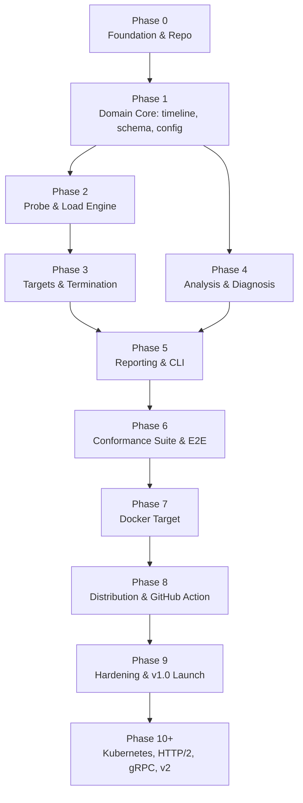

# ShutdownCheck — Phase-Wise Development Plan

Companion to `shutdowncheck-spec.md` (v0.2). The spec defines **what** we build; this defines **the order we build it in and what "done" means at each step**.

---

## Guiding sequencing principles

1. **Build inward-out: pure core first, I/O last.** The analysis engine is a pure function over an immutable timeline. Building the data model and analyzer before the network/process code means the hardest logic is testable without a single socket or subprocess.
2. **Every phase ends in something runnable or provable.** No phase is "half a subsystem." Each has a demo or a test suite that proves it.
3. **Distribution is a phase, not an afterthought.** A tool nobody can install is a tool nobody uses.
4. **The conformance suite is a deliverable, not test scaffolding.** It is simultaneously our correctness proof, our demo, and public documentation.
5. **Nothing merges without tests.** For this tool specifically, an untested verdict rule is a liability — the entire product is "trust my answer."

### Dependency graph

Phases 2 and 4 are independent of each other and can be reordered or interleaved; everything else is strictly sequential.

### Definition of Done (applies to every phase)

- [ ] All new packages have unit tests; the phase's coverage target is met.
- [ ] `go test -race ./...` passes; `go vet`, `golangci-lint`, `staticcheck`, `gosec`, `govulncheck` clean.
- [ ] No new direct dependency added without a one-line justification in the PR.
- [ ] Public behaviour documented (README section, CLI help text, or `docs/` page).
- [ ] Any decision that contradicts the spec is recorded as an ADR in `docs/adr/`.
- [ ] No secrets, no shell string interpolation, no `InsecureSkipVerify` outside the explicit `--insecure` path.

---

## Phase 0 — Foundation & Repository Setup

**Size:** S · **Goal:** A repository that builds, tests, lints, and releases correctly *before* a single line of product logic exists.

**Deliverables**
- Go module (`go 1.23+`), directory skeleton exactly per spec §7.2 with placeholder `doc.go` files.
- `Makefile` targets: `build`, `test`, `race`, `cover`, `lint`, `fuzz`, `ci`.
- `.golangci.yml` (with `gosec`, `staticcheck`, `errcheck`, `goimports`).
- GitHub Actions: `ci.yml` (linux + macOS × build/test/race/lint), `codeql.yml`, `dependency-review.yml`, `govulncheck`.
- Governance files: `LICENSE` (Apache-2.0), `README.md` stub, `CONTRIBUTING.md`, `CODE_OF_CONDUCT.md`, `SECURITY.md`, issue/PR templates (including the "misdiagnosis → attach NDJSON" template).
- `docs/adr/` seeded with ADRs for decisions **D1–D10** from spec §4.
- **Architecture guard test**: an automated test asserting `internal/analyze` and `pkg/schema` import no I/O packages (`net`, `os`, `os/exec`, `io/ioutil`). This is what keeps the analyzer pure for the life of the project.
- Name/collision check across GitHub, Homebrew, npm, crates.io, PyPI; reserve the GitHub org and `shutdowncheck.dev`.

**Exit criteria:** `make ci` green on a clean clone; CI green on a trial PR; the architecture guard test fails when deliberately violated.

**Risk:** tooling yak-shaving. Timebox hard — if a linter fights us, disable that rule with a comment and move on.

---

## Phase 1 — Domain Core (timeline · schema · config)

**Size:** M · **Goal:** The immutable data model that every other subsystem produces into or consumes from.

**Deliverables**
- `internal/timeline`
  - `Event` union covering: stage transition, request start/end, connection open/reuse/close (with FIN/RST + `Connection: close`), readiness sample, listener-accept sample, signal sent, process exit, target log line.
  - `Clock` interface with `realClock` and a fully controllable `fakeClock` (monotonic offsets only).
  - `Recorder`: concurrency-safe, non-blocking, bounded by `--max-records`; omitted verdict-bearing evidence makes the run inconclusive.
  - `Timeline` immutable snapshot + NDJSON encode/decode (round-trippable).
- `pkg/schema` — the complete public report types matching spec §13, with `schema_version`, stable field ordering, and golden-file JSON tests.
- `internal/config` — YAML model per spec §12, defaults, strict validation with actionable messages, `--scenario` selection, and `Policy` derivation (profile → accept window, severities, budgets).

**Exit criteria:** ≥90% coverage in these packages; fuzz targets for config YAML and NDJSON parsing; golden JSON byte-stable; architecture guard still passing.

**Risk:** over-modelling the event union. Keep it minimal and additive — new event kinds are cheap later, a bloated union is not.

---

## Phase 2 — Probe & Load Engine

**Size:** L · **Goal:** Generate rate-controlled traffic and capture request *and connection-level* evidence.

**Deliverables**
- `internal/probe`
  - HTTP prober with `httptrace` hooks + custom `DialContext`, recording connection reuse, establishment time, `Connection: close`, and FIN-vs-RST termination.
  - Error classifier: `refused`, `reset`, `timeout`, `eof`, `tls_error`, `dns_error`, `http_error`, `ok`.
  - Header redaction and body-size caps applied at the recording boundary (spec §14).
  - Independent **readiness prober** and independent **raw-TCP listener prober**.
- `internal/load`
  - **Open-model scheduler**: dispatch times precomputed from the rate so a slow server produces measurable queueing rather than silently reduced load (no coordinated omission).
  - Bounded worker pool with back-pressure and `--concurrency-cap`.
  - Weighted multi-request selection driven by `--seed`.
  - **Auto-calibration** per spec §7.5, including all guard rails and `SC000` emission.

**Exit criteria**
- L2 tests against `httptest` servers that hang, RST mid-response, close instantly, and respond slowly.
- Calibration converges to within ±20% of the in-flight goal against a synthetic fixed-latency server.
- `goleak` clean (no leaked goroutines or sockets); race-clean.
- A test proving offered rate is maintained when the server slows.

**Risk:** this is the most concurrency-heavy package. Mitigation: the fake clock from Phase 1, plus `-race` on every test.

---

## Phase 3 — Targets & Termination

**Size:** L · **Goal:** Start, signal, observe, and *guarantee cleanup of* real processes.

**Deliverables**
- `internal/target` with the `Target` interface (spec §7.3) and two implementations:
  - `ProcessTarget` — attach by PID.
  - `CommandTarget` — spawn with argv only, own process group, capture stdout/stderr, guaranteed group kill on every exit path (including panic and tool `SIGINT`).
- `WaitReady`: TCP port readiness and/or HTTP ready-URL readiness with timeout.
- Signal delivery with **skew measurement** (force `INCONCLUSIVE` above 50ms because phase attribution is no longer trustworthy).
- `SIGKILL` escalation at grace expiry (`--enforce-sigkill`).
- Exit detection: exit code, terminating signal, time-to-exit.
- Post-exit **port-still-bound** detection (catches orphaned children → `SC012`).
- Log tailer with size cap + redaction, interleaved into the timeline.
- Safety guards: refuse PID ≤ 1, refuse self/own process group, argv-only exec, identifier validation.
- `internal/run` orchestrator implementing the state machine in spec §7.4.

**Exit criteria**
- E2E against a Go fixture server for: exits-before-grace, exits-after-grace, ignores-signal, orphan-child-holds-port.
- Soak: 200 consecutive runs with zero leaked processes, sockets, or temp files.
- Interrupting ShutdownCheck itself always cleans up the target.
- Green on both Linux and macOS.

**Decision to close here:** open question #3 — readiness endpoint auto-discovery.

**Risk:** process-group and signal semantics differ subtly between Linux and macOS. Covered by the CI matrix from Phase 0.

---

## Phase 4 — Analysis & Diagnosis Engine

**Size:** L · **Goal:** Turn a timeline into a verdict with named, explained, actionable findings. *This is the product's intellectual core.*

**Deliverables**
- Request and connection phase classification with exact boundary handling (`T_send == T_0`, `T_complete == T_0`).
- `Policy` construction from shutdown profiles (spec §7.6).
- All **18 signatures** (`SC000`–`SC017`) implemented as independent `Signature` rules, each returning structured evidence — not prose.
- Verdict logic including the **INCONCLUSIVE** path, gate threshold evaluation, and `--fail-on` / `--ignore` severity overrides.
- Shutdown Score + grade per spec §9.2, with a versioned weight table.
- Multi-trial aggregation with consistency reporting (`3/3 FAIL` vs `1/3 FAIL — flaky`).
- `internal/remediate`: stack fingerprinting (flag → `Server` header → image name → argv) plus `go:embed`-ed remediation Markdown for the 9 v1.0 stacks + generic fallback.

**Exit criteria**
- Every signature has ≥1 positive and ≥1 negative synthetic-timeline fixture.
- A registry test **fails the build** if any registered signature has no test — this guarantee cannot be allowed to rot.
- Determinism test: the same fixture analysed 50× yields byte-identical output.
- Still zero I/O imports in `internal/analyze`.

**Decisions to close here:** open question #1 (`SC006` default severity under `auto`) and #2 (score weight calibration).

---

## Phase 5 — Reporting & CLI

**Size:** M · **Goal:** Everything the user actually touches. First real end-to-end product.

**Deliverables**
- `internal/report` renderers:
  - **Human** — the timeline visualisation from spec §3.3 (terminal-width aware, colour with TTY/`NO_COLOR` detection), phase table, connection table, findings with remediation.
  - **JSON** (versioned schema), **JUnit XML** (one `<testcase>` per signature), **Markdown** (GitHub job summary / PR comment), **NDJSON**, **SVG badge**.
- `internal/cli` (standard library `flag`): `run`, `analyze`, `demo`, `explain <SCxxx>`, `validate`, `version`.
- Flag → config → defaults precedence, `--scenario`, full help text for every flag in spec §11.
- Exit code taxonomy per spec §9.3, verified by test.
- Golden-file tests for every renderer.

**Exit criteria:** `shutdowncheck run --url … -- ./fixture-server` produces the spec §3.3 output shape end-to-end; every format has a golden test; every exit code is reachable and asserted.

**Decision to close here:** open question #5 — the `shutdowncheck analyze <run.ndjson>` re-analysis subcommand (cheap, given the pure analyzer).

**Milestone:** this is the first phase whose output is worth showing publicly. Record the demo asciinema here.

---

## Phase 6 — Conformance Suite & End-to-End Proof ✅

**Size:** L · **Goal:** Prove the "works regardless of tech stack" claim empirically rather than rhetorically.

**Deliverables**
- `test/conformance/{go,node,python}/`, one server per stack covering thirteen modes: `correct`, `ignore-signal`, `instant-close`, `no-readiness-flip`, `abrupt-reset`, `slow-drain`, `early-exit`, `listener-never-closes`, `slow-readiness`, `readiness-flap`, `nonzero-exit`, `accept-no-response`, `orphan-child`.
- One file per language rather than one per variant. The variants differ by a few lines each, so splitting them would have buried the interesting part in boilerplate and let the implementations drift apart.
- Table-driven harness: `(language, mode, profile) → expected signature set + expected verdict`, with the contract in an untagged file so it is checked on every platform including Windows.
- CI: fast `-short` unit pass on all three operating systems, plus a dedicated conformance job on Linux and macOS with Node and Python installed.
- README demo GIF — **deferred to Phase 8**, where the release tooling and `demo` command live.

**Exit criteria** — all met
- Every signature is triggered by fixtures in **at least two different languages**, enforced by `TestSignatureCoverageAcrossLanguages`. SC012 is the single exemption, documented and itself tested for continued necessity, because an orphaned listener is a defect of process topology rather than of any framework.
- **Zero false PASS**: no broken mode yields `PASS` under any supported profile.
- Every `correct` variant PASSes under its intended profile.

**Deviations from plan**
- Java and C# are deferred. Writing fixtures for toolchains that cannot be run and verified locally would have shipped code that only looks correct, which is the opposite of what this phase is for.
- The Phase 5 end-to-end fixture was deleted and the e2e suite repointed at the shared conformance server, then narrowed to the command-line surface so the two suites stop half-testing the same thing.

**Decision closed here:** open question #5 — [ADR-0013](docs/adr/0013-demo-subcommand.md). Nothing is embedded; `demo` self-spawns through a hidden subcommand and falls back to a clearly labelled recording where signals do not exist.

**Risk:** CI wall-time. Mitigated by the `-short` / full-job split rather than the originally planned nightly matrix, which is no longer needed at three languages.

---

## Phase 7 — Docker Target ✅

**Size:** M · **Goal:** Move from "a process on my laptop" to how services actually run.

**Deliverables**
- `DockerTarget`: signal via `docker kill --signal=TERM`, liveness and exit code via `docker wait`, logs via `docker logs --follow`. Driven through the CLI rather than the Engine SDK — see [ADR-0014](docs/adr/0014-docker-via-cli.md).
- Container references validated against a strict allowlist before reaching argv, single-sourced in `internal/target` so the config and run paths cannot disagree.
- Docker-specific defaults: 10s grace period, `docker` profile, both already present in the policy layer.
- Port-mapping resolution, so `--docker api --url /healthz` works without first running `docker inspect` to find the mapped port.
- Docker CLI or daemon unavailable exits `4` with an actionable message naming the alternative targets.
- The conformance matrix re-run through the Docker target, judged by the same assertions as the process target.

**Exit criteria** — met, subject to the deviation below
- All conformance modes produce identical verdicts via the Docker target as via the process target.
- Linux CI green, with the containerised run required rather than skipped there.

**Deviations from plan**
- `orphan-child` is excluded from the containerised matrix. When PID 1 exits, the daemon reaps the whole container, so an orphaned listener cannot survive to be detected. That is a property of containers, not a gap in the tool, and the exclusion is itself tested.
- Liveness is watched rather than polled. The runner asks `Alive` every 10ms; shelling out at that rate would have quantised the measured shutdown duration to process-spawn latency, corrupting the primary measurement.

**Risk:** the CLI output contract. Confined to one file, parsed as explicit JSON rather than scraped, and covered by the containerised conformance run.

---

## Phase 8 — Distribution & CI Ecosystem ✅

**Size:** M · **Goal:** Adoption in under 60 seconds, from zero prior knowledge.

**Deliverables**
- GoReleaser: linux/darwin/windows × amd64/arm64, checksums, `cosign` keyless signatures, SBOM per archive, SLSA provenance, GitHub Release automation.
- `go install` reports a real version: the binary reads `debug.ReadBuildInfo` when no ldflags were applied, so an installed build no longer calls itself `dev`.
- Checksum-verifying install script, Homebrew tap and Scoop manifest.
- Distroless multi-arch image published to GHCR. The same image doubles as its own broken demo service, so no second image has to be maintained.
- **GitHub Action** at repository-root `action.yml` as a composite action, so it adds no image to a user's supply chain. The original run emits the JSON artifact and the summary is derived from it, so custom gates cannot drift during replay.
- `shutdowncheck demo`, per [ADR-0013](docs/adr/0013-demo-subcommand.md) and [ADR-0015](docs/adr/0015-demo-without-recorded-fallback.md).
- One published page per signature under `docs/signatures/`, generated from the catalogue compiled into the binary so the website cannot drift from what the tool reports.
- README: install matrix, verification instructions, CI snippet, honest status banner.

**Exit criteria** — met in code; see the deviation below on verification
- A tagged release produces every artefact automatically.
- `go install` verified locally, including version reporting.

**Deviations from plan**
- GoReleaser v2.17.0 is the newest compatible pinned release for the available
  Go 1.26.8 toolchain. `goreleaser check`, a six-target snapshot build and a
  non-publishing archive release have all succeeded locally. CI repeats config
  validation and the snapshot build on every push.
- The demo's recorded fallback was dropped ([ADR-0015](docs/adr/0015-demo-without-recorded-fallback.md)). A genuine recording cannot be produced on the platform that needs it, and synthesising one would be fabricated evidence in the one command whose job is to earn trust.
- The docs site generator is deferred; the per-signature pages it would consume are generated and committed, which is the part that carries the value.
- The demo GIF is deferred: it needs a real terminal recording on a machine that can run the demo.

**Verified locally:** `go install` path, version injection from both ldflags and build info, the demo's platform refusal, Action/YAML/JSON contracts, signature page drift, GoReleaser config, all six release archives and SBOMs, archive contents, checksums, Homebrew/Scoop metadata, lint, vulnerability scans, fuzz targets and 80.9% aggregate coverage. SBOM generation uses checksum-verified Syft v1.51.1, matching the exact workflow pin.

**Not verifiable locally:** POSIX installer execution, Docker image build/run,
the hosted release workflow, and the Action in a real repository. This Windows
host has no Docker, POSIX shell, C toolchain, Java or real Python runtime.

**Still owed before v1.0:** the Action proven working in a throwaway repository, and `brew install`, the install script and the container image each verified on a clean machine. Written but unproven is not the same as done, and these carry over into Phase 9.

---

## Phase 9 — Hardening (v1.0 launch still pending) ⚠️

**Size:** M · **Goal:** Ship something people can reasonably bet a merge gate on.

**Delivered**
- Fuzz suites for the config parser, the NDJSON timeline parser and the report renderers, all wired into CI with crashers uploaded on failure. The renderer target is the interesting one: it is where arbitrary recorded evidence meets the column arithmetic of the timeline visualisation. 1.9M executions, no crashes.
- Security self-review against spec §14, which found four real gaps and closed them: argv secrets reaching reports, `--insecure` neither warned about nor recorded, no wall-clock ceiling, and no `--allow-unsafe-pid`.
- Redaction proven end to end, against a recording deliberately handed credentials by every route the tool records. Unit tests could not have caught the failure that mattered — a redaction helper that is correct but never called.
- Budget tests: binary size, startup latency, direct dependency count, and verdict stability across repeated runs, with the fifty-iteration version behind `-stability` and run on main.
- Documentation: [the seven stages explainer](docs/seven-stages.md), all eighteen signature pages generated from the catalogue, and a test that fails if any registered flag is missing from `--help`.
- Deep release-readiness audit of runtime, parsers, resource bounds, redaction,
  report semantics, Docker/process identity and cleanup, CLI/config precedence,
  the root Action, immutable workflow inputs and GoReleaser. Every confirmed
  defect has a focused regression.

**Measured against spec §19**
| Criterion | Budget | Actual |
|---|---|---|
| Binary size | < 15 MB | **7.76 MB** |
| Direct dependencies | < 10 | **1** |
| Every signature in ≥ 2 languages | required | enforced by a build-failing guard |
| Zero false PASS | required | asserted for every conformance mode |
| Verdict stability | 50 runs | enforced on main; 6 runs per PR |
| Local `go test`, golangci-lint, gosec, govulncheck | clean | **passed** |
| Aggregate coverage | informative | **80.9%** |
| Linux/Darwin/Windows vet + release cross-build | required | **passed** |
| `go test -race` and real POSIX/Docker conformance | clean | CI/external machine required |

**Deviations from plan**
- Two spec claims were corrected rather than implemented. Record capping **drops** with a recorded notice instead of reservoir sampling, because sampling would silently thin the requests around the signal — precisely the evidence every signature depends on. And the wall-clock ceiling exits `4`, not `5`: the likely cause is a target that never became ready, and reporting that as an internal error would send users to the issue tracker instead of to their own service.
- The "sub-50ms startup" target is asserted at 200ms median. A Go binary starts in roughly 10ms, but the budget exists to catch expensive package initialisation, not to police the scheduling noise of a shared CI runner.
- Report schema bumped to `1.1` for the additive `probe.insecure` field, per [ADR-0009](docs/adr/0009-public-versioned-report-schema.md).

**Not done — this is why the phase is not closed**
- `v1.0.0` is **not** tagged. Local release construction is proven, but the
  hosted publishing path, POSIX installer, pushed container image, package taps
  and GitHub Action have not been exercised against a real repository.
- Launch posts are deliberately not written until a release exists that someone can actually install.

**To close Phase 9:** push to a real repository, let CI run every job, cut a `v0.9.0` pre-release to exercise the pipeline end to end, verify `brew`/`install.sh`/`go install`/the image on a clean machine, prove the Action in a throwaway repo — then tag `v1.0.0`.

---

## Phase 10+ — Post-1.0

| Version | Theme | Notes |
|---|---|---|
| **v1.1** | Kubernetes pod targeting + Docker Compose services | Real Endpoints de-registration observation; the `kubernetes` profile finally gets tested against actual Kubernetes. Highest-value follow-up. |
| **v1.2** | HTTP/2 with `GOAWAY` verification; native Windows termination | `GOAWAY` handling is genuinely under-tested industry-wide — a strong differentiator. |
| **v1.3** | gRPC probing, including streaming-RPC drain semantics | |
| **v2.0** | `shutdowncheck compare` — local run history and regression detection | Rule-based and comparative. Still no ML. |
| **v2.x** | Rolling-deploy simulation with an embedded load balancer | N instances, sequential termination, assert end-to-end zero-error deploys. The natural end state of the product thesis. |

---

## How we will work through this

- **One phase per working session.** At the start of a phase: restate goal + deliverables, confirm any open decisions, then implement.
- **Phase gate:** we do not begin phase *N+1* until phase *N*'s exit criteria are demonstrably met (tests green, artifacts produced).
- **Open questions are closed in the phase that owns them** — listed explicitly above, so none of them silently survives to v1.0.
- **Scope discipline:** any idea that arrives mid-phase and is not in spec §6 goes to the backlog as a GitHub issue, not into the current branch. The spec's non-goals (§5) are binding.
