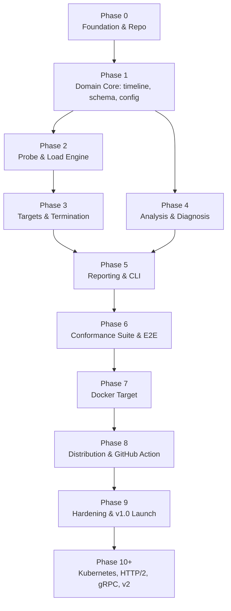

# ShutdownCheck — Phase-Wise Development Plan

Companion to `shutdowncheck-spec.md` (v0.2). The spec defines **what** we build; this defines **the order we build it in and what "done" means at each step**.

---

## Guiding sequencing principles

1. **Build inward-out: pure core first, I/O last.** The analysis engine is a pure function over an immutable timeline. Building the data model and analyzer before the network/process code means the hardest logic is testable without a single socket or subprocess.
2. **Every phase ends in something runnable or provable.** No phase is "half a subsystem." Each has a demo or a test suite that proves it.
3. **Distribution is a phase, not an afterthought.** A tool nobody can install is a tool nobody uses.
4. **The conformance suite is a deliverable, not test scaffolding.** It is simultaneously our correctness proof, our demo, and public documentation.
5. **Nothing merges without tests.** For this tool specifically, an untested verdict rule is a liability — the entire product is "trust my answer."

### Dependency graph

Phases 2 and 4 are independent of each other and can be reordered or interleaved; everything else is strictly sequential.

### Definition of Done (applies to every phase)

- [ ] All new packages have unit tests; the phase's coverage target is met.
- [ ] `go test -race ./...` passes; `go vet`, `golangci-lint`, `staticcheck`, `gosec`, `govulncheck` clean.
- [ ] No new direct dependency added without a one-line justification in the PR.
- [ ] Public behaviour documented (README section, CLI help text, or `docs/` page).
- [ ] Any decision that contradicts the spec is recorded as an ADR in `docs/adr/`.
- [ ] No secrets, no shell string interpolation, no `InsecureSkipVerify` outside the explicit `--insecure` path.

---

## Phase 0 — Foundation & Repository Setup

**Size:** S · **Goal:** A repository that builds, tests, lints, and releases correctly *before* a single line of product logic exists.

**Deliverables**
- Go module (`go 1.23+`), directory skeleton exactly per spec §7.2 with placeholder `doc.go` files.
- `Makefile` targets: `build`, `test`, `race`, `cover`, `lint`, `fuzz`, `ci`.
- `.golangci.yml` (with `gosec`, `staticcheck`, `errcheck`, `goimports`).
- GitHub Actions: `ci.yml` (linux + macOS × build/test/race/lint), `codeql.yml`, `dependency-review.yml`, `govulncheck`.
- Governance files: `LICENSE` (Apache-2.0), `README.md` stub, `CONTRIBUTING.md`, `CODE_OF_CONDUCT.md`, `SECURITY.md`, issue/PR templates (including the "misdiagnosis → attach NDJSON" template).
- `docs/adr/` seeded with ADRs for decisions **D1–D10** from spec §4.
- **Architecture guard test**: an automated test asserting `internal/analyze` and `pkg/schema` import no I/O packages (`net`, `os`, `os/exec`, `io/ioutil`). This is what keeps the analyzer pure for the life of the project.
- Name/collision check across GitHub, Homebrew, npm, crates.io, PyPI; reserve the GitHub org and `shutdowncheck.dev`.

**Exit criteria:** `make ci` green on a clean clone; CI green on a trial PR; the architecture guard test fails when deliberately violated.

**Risk:** tooling yak-shaving. Timebox hard — if a linter fights us, disable that rule with a comment and move on.

---

## Phase 1 — Domain Core (timeline · schema · config)

**Size:** M · **Goal:** The immutable data model that every other subsystem produces into or consumes from.

**Deliverables**
- `internal/timeline`
  - `Event` union covering: stage transition, request start/end, connection open/reuse/close (with FIN/RST + `Connection: close`), readiness sample, listener-accept sample, signal sent, process exit, target log line.
  - `Clock` interface with `realClock` and a fully controllable `fakeClock` (monotonic offsets only).
  - `Recorder`: concurrency-safe, non-blocking, bounded with reservoir sampling above `--max-records`.
  - `Timeline` immutable snapshot + NDJSON encode/decode (round-trippable).
- `pkg/schema` — the complete public report types matching spec §13, with `schema_version`, stable field ordering, and golden-file JSON tests.
- `internal/config` — YAML model per spec §12, defaults, strict validation with actionable messages, `--scenario` selection, and `Policy` derivation (profile → accept window, severities, budgets).

**Exit criteria:** ≥90% coverage in these packages; fuzz targets for config YAML and NDJSON parsing; golden JSON byte-stable; architecture guard still passing.

**Risk:** over-modelling the event union. Keep it minimal and additive — new event kinds are cheap later, a bloated union is not.

---

## Phase 2 — Probe & Load Engine

**Size:** L · **Goal:** Generate rate-controlled traffic and capture request *and connection-level* evidence.

**Deliverables**
- `internal/probe`
  - HTTP prober with `httptrace` hooks + custom `DialContext`, recording connection reuse, establishment time, `Connection: close`, and FIN-vs-RST termination.
  - Error classifier: `refused`, `reset`, `timeout`, `eof`, `tls_error`, `dns_error`, `http_error`, `ok`.
  - Header redaction and body-size caps applied at the recording boundary (spec §14).
  - Independent **readiness prober** and independent **raw-TCP listener prober**.
- `internal/load`
  - **Open-model scheduler**: dispatch times precomputed from the rate so a slow server produces measurable queueing rather than silently reduced load (no coordinated omission).
  - Bounded worker pool with back-pressure and `--concurrency-cap`.
  - Weighted multi-request selection driven by `--seed`.
  - **Auto-calibration** per spec §7.5, including all guard rails and `SC000` emission.

**Exit criteria**
- L2 tests against `httptest` servers that hang, RST mid-response, close instantly, and respond slowly.
- Calibration converges to within ±20% of the in-flight goal against a synthetic fixed-latency server.
- `goleak` clean (no leaked goroutines or sockets); race-clean.
- A test proving offered rate is maintained when the server slows.

**Risk:** this is the most concurrency-heavy package. Mitigation: the fake clock from Phase 1, plus `-race` on every test.

---

## Phase 3 — Targets & Termination

**Size:** L · **Goal:** Start, signal, observe, and *guarantee cleanup of* real processes.

**Deliverables**
- `internal/target` with the `Target` interface (spec §7.3) and two implementations:
  - `ProcessTarget` — attach by PID.
  - `CommandTarget` — spawn with argv only, own process group, capture stdout/stderr, guaranteed group kill on every exit path (including panic and tool `SIGINT`).
- `WaitReady`: TCP port readiness and/or HTTP ready-URL readiness with timeout.
- Signal delivery with **skew measurement** (flag the run low-confidence above 50ms skew).
- `SIGKILL` escalation at grace expiry (`--enforce-sigkill`).
- Exit detection: exit code, terminating signal, time-to-exit.
- Post-exit **port-still-bound** detection (catches orphaned children → `SC012`).
- Log tailer with size cap + redaction, interleaved into the timeline.
- Safety guards: refuse PID ≤ 1, refuse self/own process group, argv-only exec, identifier validation.
- `internal/run` orchestrator implementing the state machine in spec §7.4.

**Exit criteria**
- E2E against a Go fixture server for: exits-before-grace, exits-after-grace, ignores-signal, orphan-child-holds-port.
- Soak: 200 consecutive runs with zero leaked processes, sockets, or temp files.
- Interrupting ShutdownCheck itself always cleans up the target.
- Green on both Linux and macOS.

**Decision to close here:** open question #3 — readiness endpoint auto-discovery.

**Risk:** process-group and signal semantics differ subtly between Linux and macOS. Covered by the CI matrix from Phase 0.

---

## Phase 4 — Analysis & Diagnosis Engine

**Size:** L · **Goal:** Turn a timeline into a verdict with named, explained, actionable findings. *This is the product's intellectual core.*

**Deliverables**
- Request and connection phase classification with exact boundary handling (`T_send == T_0`, `T_complete == T_0`).
- `Policy` construction from shutdown profiles (spec §7.6).
- All **18 signatures** (`SC000`–`SC017`) implemented as independent `Signature` rules, each returning structured evidence — not prose.
- Verdict logic including the **INCONCLUSIVE** path, gate threshold evaluation, and `--fail-on` / `--ignore` severity overrides.
- Shutdown Score + grade per spec §9.2, with a versioned weight table.
- Multi-trial aggregation with consistency reporting (`3/3 FAIL` vs `1/3 FAIL — flaky`).
- `internal/remediate`: stack fingerprinting (flag → `Server` header → image name → argv) plus `go:embed`-ed remediation Markdown for the 9 v1.0 stacks + generic fallback.

**Exit criteria**
- Every signature has ≥1 positive and ≥1 negative synthetic-timeline fixture.
- A registry test **fails the build** if any registered signature has no test — this guarantee cannot be allowed to rot.
- Determinism test: the same fixture analysed 50× yields byte-identical output.
- Still zero I/O imports in `internal/analyze`.

**Decisions to close here:** open question #1 (`SC006` default severity under `auto`) and #2 (score weight calibration).

---

## Phase 5 — Reporting & CLI

**Size:** M · **Goal:** Everything the user actually touches. First real end-to-end product.

**Deliverables**
- `internal/report` renderers:
  - **Human** — the timeline visualisation from spec §3.3 (terminal-width aware, colour with TTY/`NO_COLOR` detection), phase table, connection table, findings with remediation.
  - **JSON** (versioned schema), **JUnit XML** (one `<testcase>` per signature), **Markdown** (GitHub job summary / PR comment), **NDJSON**, **SVG badge**.
- `internal/cli` (cobra): `run`, `explain <SCxxx>`, `validate`, `version`.
- Flag → config → defaults precedence, `--scenario`, full help text for every flag in spec §11.
- Exit code taxonomy per spec §9.3, verified by test.
- Golden-file tests for every renderer.

**Exit criteria:** `shutdowncheck run --url … -- ./fixture-server` produces the spec §3.3 output shape end-to-end; every format has a golden test; every exit code is reachable and asserted.

**Decision to close here:** open question #5 — the `shutdowncheck analyze <run.ndjson>` re-analysis subcommand (cheap, given the pure analyzer).

**Milestone:** this is the first phase whose output is worth showing publicly. Record the demo asciinema here.

---

## Phase 6 — Conformance Suite & End-to-End Proof ✅

**Size:** L · **Goal:** Prove the "works regardless of tech stack" claim empirically rather than rhetorically.

**Deliverables**
- `test/conformance/{go,node,python}/`, one server per stack covering thirteen modes: `correct`, `ignore-signal`, `instant-close`, `no-readiness-flip`, `abrupt-reset`, `slow-drain`, `early-exit`, `listener-never-closes`, `slow-readiness`, `readiness-flap`, `nonzero-exit`, `accept-no-response`, `orphan-child`.
- One file per language rather than one per variant. The variants differ by a few lines each, so splitting them would have buried the interesting part in boilerplate and let the implementations drift apart.
- Table-driven harness: `(language, mode, profile) → expected signature set + expected verdict`, with the contract in an untagged file so it is checked on every platform including Windows.
- CI: fast `-short` unit pass on all three operating systems, plus a dedicated conformance job on Linux and macOS with Node and Python installed.
- README demo GIF — **deferred to Phase 8**, where the release tooling and `demo` command live.

**Exit criteria** — all met
- Every signature is triggered by fixtures in **at least two different languages**, enforced by `TestSignatureCoverageAcrossLanguages`. SC012 is the single exemption, documented and itself tested for continued necessity, because an orphaned listener is a defect of process topology rather than of any framework.
- **Zero false PASS**: no broken mode yields `PASS` under any supported profile.
- Every `correct` variant PASSes under its intended profile.

**Deviations from plan**
- Java and C# are deferred. Writing fixtures for toolchains that cannot be run and verified locally would have shipped code that only looks correct, which is the opposite of what this phase is for.
- The Phase 5 end-to-end fixture was deleted and the e2e suite repointed at the shared conformance server, then narrowed to the command-line surface so the two suites stop half-testing the same thing.

**Decision closed here:** open question #5 — [ADR-0013](docs/adr/0013-demo-subcommand.md). Nothing is embedded; `demo` self-spawns through a hidden subcommand and falls back to a clearly labelled recording where signals do not exist.

**Risk:** CI wall-time. Mitigated by the `-short` / full-job split rather than the originally planned nightly matrix, which is no longer needed at three languages.

---

## Phase 7 — Docker Target

**Size:** M · **Goal:** Move from "a process on my laptop" to how services actually run.

**Deliverables**
- `DockerTarget`: signal via `docker kill --signal=TERM`, liveness and exit code via `docker inspect`, logs via `docker logs --follow`.
- Container identifier validation against a strict allowlist regex before it ever reaches argv.
- Docker-specific defaults: 10s grace period, `docker` profile.
- Port-mapping resolution so the probe URL can be derived from the container.
- Clear, actionable degradation when the Docker CLI or daemon is unavailable (exit code `4`, not a stack trace).
- E2E: the entire conformance matrix re-run through the Docker target.

**Exit criteria:** all conformance variants produce identical verdicts via the Docker target as via the process target (modulo profile differences); Linux CI green.

---

## Phase 8 — Distribution & CI Ecosystem

**Size:** M · **Goal:** Adoption in under 60 seconds, from zero prior knowledge.

**Deliverables**
- GoReleaser: linux/darwin/windows × amd64/arm64, checksums, `cosign` signatures, SBOM, SLSA provenance, GitHub Release automation.
- `go install` path verified; Homebrew tap; Scoop manifest; checksum-verifying install script.
- Distroless multi-arch container image published to GHCR.
- **GitHub Action** in `action/`, published to the Marketplace: runs the check, uploads the JSON report artifact, writes Markdown to `$GITHUB_STEP_SUMMARY`, optionally posts/updates a PR comment.
- Docs site generated from `docs/`, with one page per signature (the long-tail SEO engine — someone searching "connection reset during kubernetes rolling update" should land on `SC004`).
- README: problem statement, demo GIF, install matrix, quick start, score badge, honest scope/limitations section.

**Exit criteria:** a tagged release produces every artifact automatically; the Action verified working in a throwaway repository; `brew install`, `go install`, and the container image all verified on a clean machine.

---

## Phase 9 — Hardening & v1.0 Launch

**Size:** M · **Goal:** Ship something people can reasonably bet a merge gate on.

**Deliverables**
- Fuzz suites (config, NDJSON, JSON report), soak suite, and the 50× flakiness suite wired into CI.
- Full security self-review against spec §14; `gosec`, `govulncheck`, CodeQL clean; redaction verified by test against a report containing an `Authorization` header.
- Performance pass: binary < 15MB, bounded memory at 100k records, sub-50ms startup.
- Documentation audit: every flag documented, every signature page written, "seven stages of correct termination" explainer published as the conceptual anchor.
- `CHANGELOG.md`, semantic versioning, `v1.0.0` tag.
- Launch: Hacker News, r/devops, r/kubernetes, Go Weekly, CNCF Slack — led with the demo GIF and the seven-stages explainer rather than the feature list.

**Exit criteria:** every technical success criterion in spec §19 is objectively met and demonstrable.

---

## Phase 10+ — Post-1.0

| Version | Theme | Notes |
|---|---|---|
| **v1.1** | Kubernetes pod targeting + Docker Compose services | Real Endpoints de-registration observation; the `kubernetes` profile finally gets tested against actual Kubernetes. Highest-value follow-up. |
| **v1.2** | HTTP/2 with `GOAWAY` verification; native Windows termination | `GOAWAY` handling is genuinely under-tested industry-wide — a strong differentiator. |
| **v1.3** | gRPC probing, including streaming-RPC drain semantics | |
| **v2.0** | `shutdowncheck compare` — local run history and regression detection | Rule-based and comparative. Still no ML. |
| **v2.x** | Rolling-deploy simulation with an embedded load balancer | N instances, sequential termination, assert end-to-end zero-error deploys. The natural end state of the product thesis. |

---

## How we will work through this

- **One phase per working session.** At the start of a phase: restate goal + deliverables, confirm any open decisions, then implement.
- **Phase gate:** we do not begin phase *N+1* until phase *N*'s exit criteria are demonstrably met (tests green, artifacts produced).
- **Open questions are closed in the phase that owns them** — listed explicitly above, so none of them silently survives to v1.0.
- **Scope discipline:** any idea that arrives mid-phase and is not in spec §6 goes to the backlog as a GitHub issue, not into the current branch. The spec's non-goals (§5) are binding.
